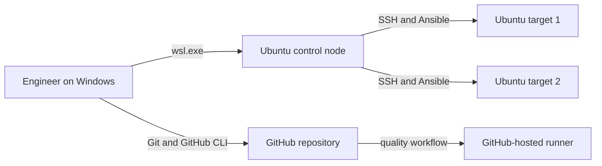

# Lab Architecture

## Boundaries

- Windows owns the WSL2 virtual machine, networking and shared kernel lifecycle.
- Each distribution has an isolated root filesystem, users, processes and service configuration.
- The control node stores no private key in Git; credentials remain in the user profile.
- Generated inventories and WSL exports are local artifacts and are ignored by Git.
- GitHub Actions validates portable repository logic but does not claim to validate WSL-specific runtime behaviour.

## Known Limitations

- WSL2 distributions share one kernel, so this is not a substitute for separate hypervisor-backed production nodes.
- Network addressing may change after WSL restart.
- Windows sleep, VPN and proxy changes can affect WSL DNS and routing.
- Kernel hardening controls cannot be demonstrated independently per target instance.

These limitations are acceptable for the first lab because the learning goals are Linux users, services, permissions, network diagnostics and idempotent configuration. Hypervisor-backed validation remains a future portability test.
